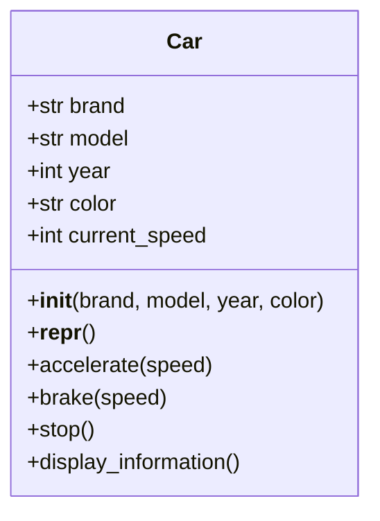

# Class Diagram - Car

## Version Evolution

| Version | Change |
|---------|--------|
| V1 | Empty `Car` class |
| V2 | Added constructor (`__init__`) |
| V3 | Added `__repr__()` |
| V4 | Added behavior methods (`accelerate`, `brake`, `stop`, `display_information`) |
| V5 | Added unit tests |

---

## Overview

The `Car` class is our first object-oriented model. It demonstrates how a real-world entity can be represented using **state (attributes)** and **behavior (methods)**.

---

## Mermaid UML

---

## Design Notes

- The class models a single car.
- State is stored using instance variables.
- Behavior modifies the object's own state.
- `current_speed` starts at `0`, representing a stationary car.
- `__repr__()` provides a developer-friendly representation for debugging.

---

## Future Improvements

This implementation is intentionally simple. In later lessons we will improve it by:

- Encapsulating attributes using properties.
- Validating constructor inputs.
- Preventing invalid operations (for example, negative acceleration).
- Applying SOLID principles.
- Adding richer unit tests for edge cases.