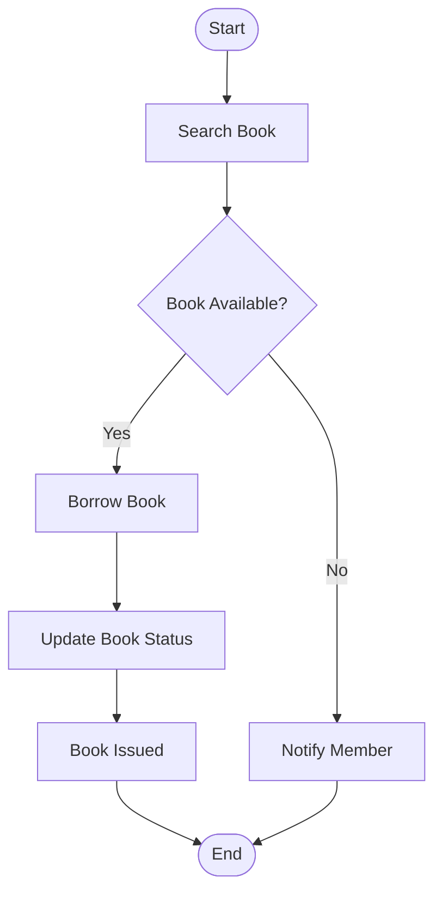

# Activity Diagram - Borrow a Book

## Problem Statement

Illustrate the business workflow for borrowing a book.

---

---

## Observation

This diagram models the **business process**, not the software objects.

It answers:

- What steps are involved?
- What decisions are made?
- What are the possible outcomes?