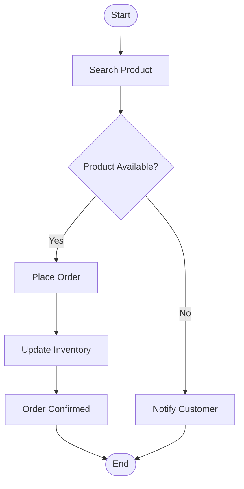

# Activity Diagram - Place Order

## Problem Statement

Model the business workflow involved in placing an order.

Unlike the Sequence Diagram, this diagram focuses on **business activities** rather than object communication.

---

## Mermaid UML

---

# Observation

This diagram answers:

- What business steps occur?
- What decisions are made?
- What are the possible outcomes?

It does **not** show which objects communicate.

---

# Key Takeaways

- Activity Diagrams represent workflows.
- Decision nodes create multiple execution paths.
- They are useful for understanding business processes before implementation.