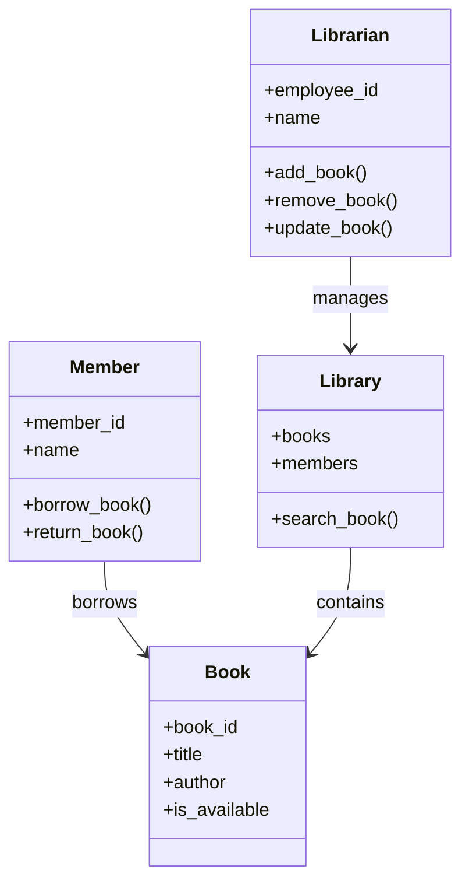

# Class Diagram - Library Management System

## Problem Statement

Identify the core objects (classes) involved in a simple Library Management System and show how they are related.

---

---

## Observation

This diagram answers:

- What are the important classes?
- What responsibilities do they have?
- How are they related?

It does **not** show the order in which methods are called.