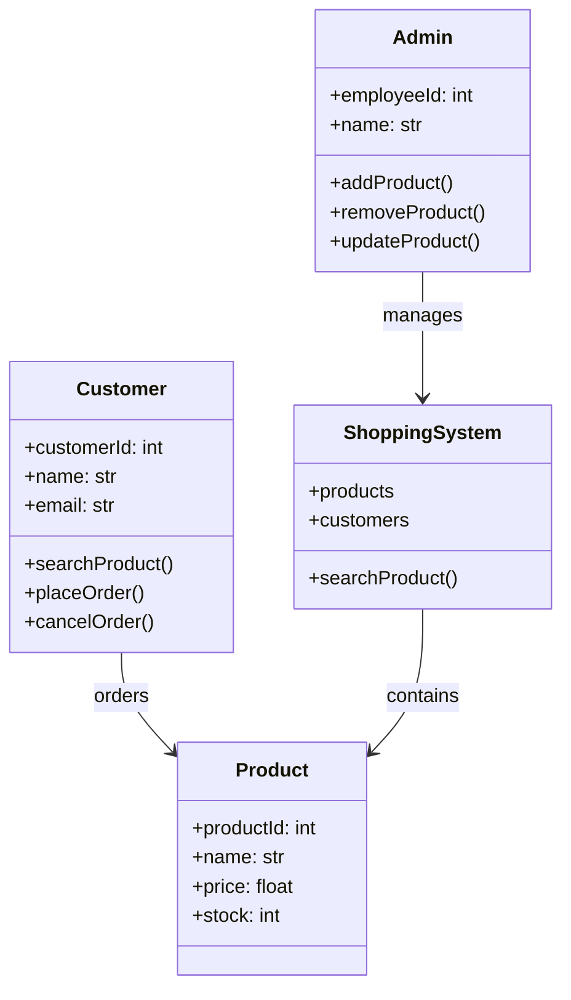

# Class Diagram - Online Shopping System

## Problem Statement

Identify the core classes required to model a simple Online Shopping System.

Unlike the Use Case Diagram, this diagram focuses on the **structure** of the system rather than user interactions.

---

## Requirement Analysis

### Actors

- Customer
- Admin

### Candidate Classes

- Customer
- Product
- ShoppingSystem
- Admin

### Candidate Methods

- searchProduct()
- placeOrder()
- cancelOrder()
- addProduct()
- removeProduct()
- updateProduct()

---

## Mermaid UML

---

# Observation

This diagram answers:

- What classes exist?
- What responsibilities do they have?
- How are they related?

It does **not** explain the runtime order of execution.

---

# Key Takeaways

- Nouns in requirements often become classes.
- Verbs often become methods.
- Class Diagrams model structure, not behavior.