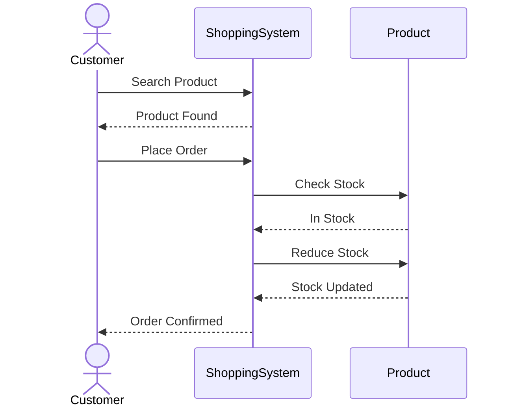

# Sequence Diagram - Place Order

## Problem Statement

Illustrate the interaction between objects when a customer places an order.

Unlike the Class Diagram, this diagram focuses on **runtime communication**.

---

## Mermaid UML

---

# Observation

This diagram answers:

- Which object starts the interaction?
- Which object communicates next?
- What messages are exchanged?
- In what order do they occur?

---

# Key Takeaways

- Sequence Diagrams represent runtime behavior.
- Time flows from top to bottom.
- Horizontal arrows represent messages exchanged between objects.
- They are excellent for explaining workflows during interviews.