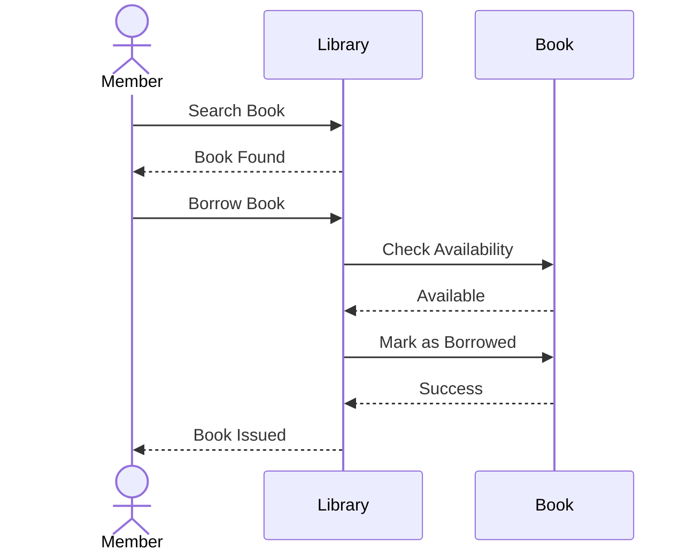

# Sequence Diagram - Borrow a Book

## Problem Statement

Illustrate the interaction between the objects involved when a member borrows a book.

---

---

## Observation

This diagram focuses on the **runtime interaction** between objects.

It answers:

- Which object communicates first?
- What messages are exchanged?
- In what sequence do they occur?

Unlike a Class Diagram, it emphasizes **behavior over structure**.