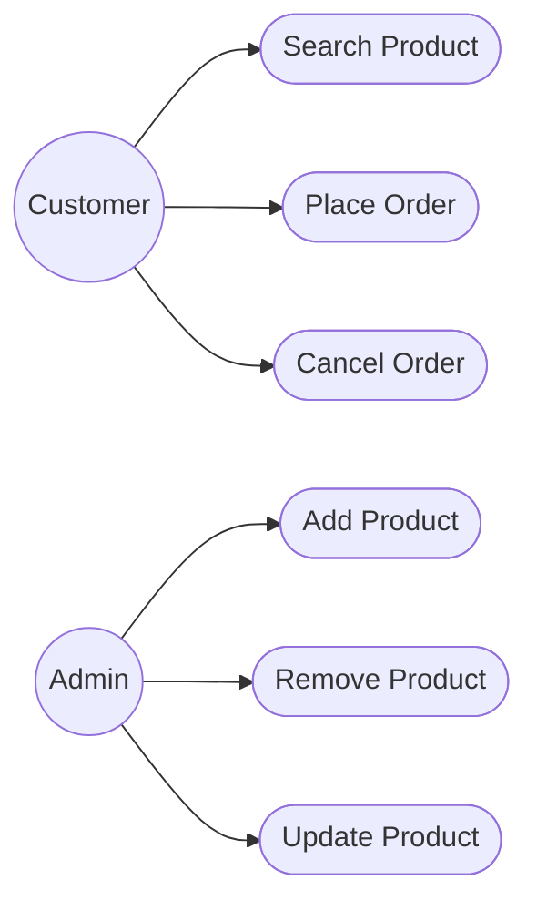

# Use Case Diagram - Online Shopping System

## Problem Statement

Model the interactions between users and the Online Shopping System.

---

---

## Observation

This diagram answers:

- Who uses the system?
- What actions can they perform?

It does **not** describe:

- Internal classes
- Object interactions
- Execution order

Those are represented using other UML diagrams.

---

## Key Takeaways

- Actors are external entities.
- Use Cases represent user goals.
- One actor can perform multiple use cases.
- This diagram captures system functionality from the user's perspective.