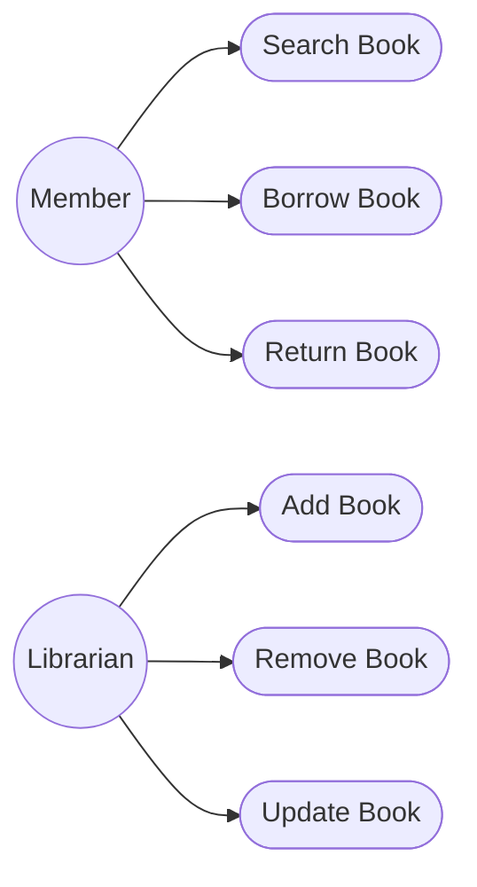

# Use Case Diagram - Library Management System

## Problem Statement

Model the interactions between users and the Library Management System.

---

---

## Observation

This diagram answers **WHO** uses the system and **WHAT** they can do.

It does **not** describe:

- Internal classes
- Object interactions
- Execution order

Those will be covered by other UML diagrams.